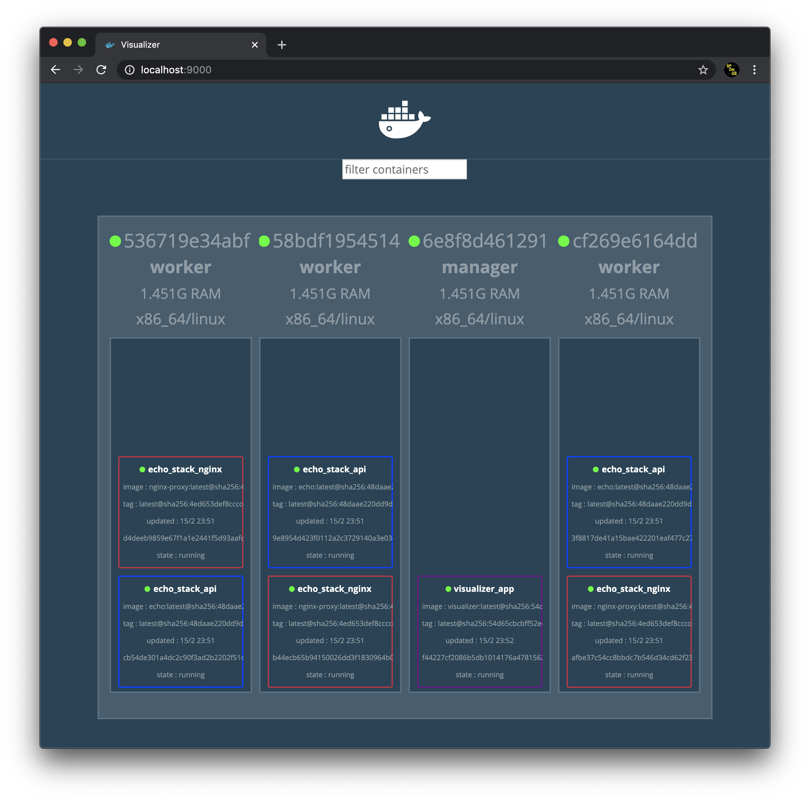
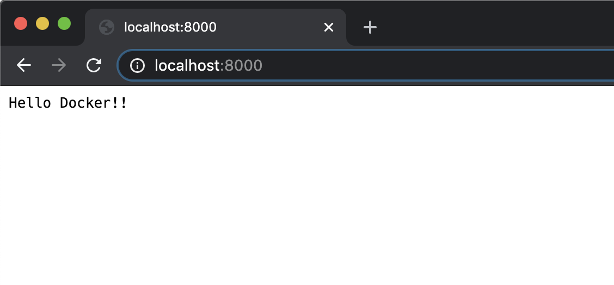

# Demo of Deploying Container

## Simulate Multi-container

### Prepare DinD(Docker-in-Docker)

```bash
# PREPARE
docker-compose up -d

# CHECK
docker container ls
  # registry Container 1ea
  # manager container 1ea
  # worker container 3ea (01~03)
```

### Ochestration With Swarm

#### Init by `manager` and participate `worker`s using tokens.

```bash
# INIT SWARM TO MANAGER CONTAINER
docker container exec -it manager docker swarm init
  # === RESULT ===
  # Swarm initialized: current node (sqgvxajbrs2b59xo3jl1y887t) is now a manager.
  # To add a worker to this swarm, run the following command:
  #     docker swarm join --token SWMTKN-1-2wv4nrpjdg3tjnpl5mcypv7hp20e88iahefr0bufuslzrs3ir7-aaugswy1uz5o5sruc9he8q11y 172.18.0.3:2377
  # To add a manager to this swarm, run 'docker swarm join-token manager' and follow the instructions.

# JOIN SWARM TO WORKER CONTAINER (REPEAT ALL OF THEM)
docker container exec -it worker01 docker swarm join \
--token SWMTKN-1-2wv4nrpjdg3tjnpl5mcypv7hp20e88iahefr0bufuslzrs3ir7-aaugswy1uz5o5sruc9he8q11y manager:2377
  # === RESULT ===
  # This node joined a swarm as a worker.

# CHECK
docker container exec -it manager docker node ls
  # === RESULT ===
  # ID                            HOSTNAME            STATUS              AVAILABILITY        MANAGER STATUS      ENGINE VERSION
  # sqgvxajbrs2b59xo3jl1y887t *   6e8f8d461291        Ready               Active              Leader              18.05.0-ce
  # 9w1pdxo9p907x22h3469pyl88     58bdf1954514        Ready               Active                                  18.05.0-ce
  # qvtfo6xuw8o14osqekr7zgz2o     536719e34abf        Ready               Active                                  18.05.0-ce
  # cbzuvsgsp9s99lbs5ewwik7de     cf269e6164dd        Ready               Active                                  18.05.0-ce
```

#### Make `host` to push image to `registry container`.

```bash
# BUILD DOCKER IMAGE USING STEP-1-COMPOSE IMAGE
docker build -t example/echo:latest \
-f "../step-1-compose/Dockerfile-step1" ../step-1-compose/.
  # CHECK
  docker image ls | grep echo

# TAG DOCKER IMAGE FOR REGISTRY CONTAINER
docker image tag example/echo:latest localhost:5000/example/echo:latest
  # CHECK
  docker image ls | grep echo

# PUSH DOCKER IMAGE TO REGISTRY CONTAINER
docker image push localhost:5000/example/echo:latest
  # === RESULT ===
  # The push refers to repository [localhost:5000/example/echo]
  # ...
  # latest: digest: sha256:... size: 2418
```

#### Make `worker`s to pull image from `registry container`.

```bash
# REPEAT WORKERS (3ea)
docker container exec -it worker01 \
docker image pull registry:5000/example/echo:latest
  # === RESULT ===
  # latest: Pulling from example/echo
  # ...
  # Digest: sha256:...
  # Status: Downloaded newer image for registry:5000/example/echo:latest
```

#### Fininsh!

This procedure is the basic method of using private docker registry.

---

## Service

The `service` of docker swarm is the `unit` that containers are `part of application`.

### Make service from registry.

```bash
# RUN 1 SERVICE REPLICA
docker container exec -it manager \
docker service create --replicas 1 \
--publish 8000:8080 \
--name echo_replica \
registry:5000/example/echo:latest
  # === RESULT ===
  # overall progress: 1 out of 1 tasks
  # 1/1: running   [==================================================>]
  # verify: Service converged

# CHECK 1 REPlICA
docker container exec -it manager \
docker service ls

# CHECK 1 CONTAINER
docker container exec -it manager \
docker service ps echo_replica
```

### Scale out the service.

```bash
# SCALE OUT UPTO 6 SERVICE REPLICAS
docker container exec -it manager \
docker service scale echo_replica=6
  # === RESULT ===
  # echo_replica scaled to 6
  # overall progress: 6 out of 6 tasks
  # 1/6: running   [==================================================>]
  # ...
  # 6/6: running   [==================================================>]
  # verify: Service converged

# CHECK 6 REPLICAS
docker container exec -it manager \
docker service ls

# CHECK 6 CONTAINERS
docker container exec -it manager \
docker service ps echo_replica

# REMOVE SERVICE
docker container exec -it manager \
docker service rm echo_replica
```

---

## Stack

The `stack` of docker swarm is the `group of services` that is consist of `entire application`.  
Simple, stack is compose that can do these - scale in/out and set contstraints.

Stack uses overlay docker network in where docker containers can communicate with each other.

```bash
# MAKE OVERLAY NETWORK
docker container exec -it manager \
docker network create --driver=overlay --attachable netcluster

# CHECK << scope is swarm
docker container exec -it manager \
docker network ls | grep overlay
```

### Use stack!

Using `stack/webapi.yml` can be provisioned below result.

- In netcluster overlay network..
- nginx proxy container (Front-end)
- echo container (Back-end)

```bash
# `./stack/*` DIRECTORY IS MOUNTED IN MANAGERE CONTAINER AT `/stack/*` DIRECTORY

# DEPLOY 'webapi.yml' STACK
docker container exec -it manager \
docker stack deploy -c /stack/webapi.yml echo_stack
  # === RESULT ===
  # Creating service echo_stack_api
  # Creating service echo_stack_nginx

# CHECK STACK DEPLOYED
docker container exec -it manager \
docker stack services echo_stack
  # === RESULT ===
  # ID            NAME              MODE        REPLICAS  IMAGE
  # 5ojgjuffoj26  echo_stack_nginx  replicated  3/3       gihyodocker/nginx-proxy:latest
  # n30mih757g4w  echo_stack_api    replicated  3/3       registry:5000/example/echo:latest

# CHECK STACK CONTAINER PROCESS
docker container exec -it manager \
docker stack ps echo_stack
  # === RESULT ===
  # ID            NAME                 IMAGE                               NODE           DESIRED STATE   CURRENT STATE          ERROR    PORTS
  # msuadp2rqs97  echo_stack_nginx.1   gihyodocker/nginx-proxy:latest      536719e34abf   Running         Running 1 second ago
  # awfcyp53q8v7  echo_stack_api.1     registry:5000/example/echo:latest   58bdf1954514   Running         Running 28 seconds ago
  # u0tp5e0r9fkw  echo_stack_nginx.2   gihyodocker/nginx-proxy:latest      cf269e6164dd   Running         Running 1 second ago
  # fxnogpu8da27  echo_stack_api.2     registry:5000/example/echo:latest   536719e34abf   Running         Running 28 seconds ago
  # mbmjvc6tfe5d  echo_stack_nginx.3   gihyodocker/nginx-proxy:latest      58bdf1954514   Running         Running 1 second ago
  # vzejdcy9qv1p  echo_stack_api.3     registry:5000/example/echo:latest   cf269e6164dd   Running         Running 28 seconds ago

# REMOVE STACK
docker container exec -it manager \
docker stack rm echo_stack
  # === RESULT ===
  # Removing service echo_stack_api
  # Removing service echo_stack_nginx
```

### View the status of stack!

Visualize with visualizer container

```bash
# `./stack/*` DIRECTORY IS MOUNTED IN MANAGERE CONTAINER AT `/stack/*` DIRECTORY

# DEPLOY 'visualizer.yml' STACK
# (TO DEPLOY, `echo_stack` IS REQUIRED.)
docker container exec -it manager \
docker stack deploy -c /stack/visualizer.yml visualizer
  # === RESULT ===
  # Creating network visualizer_default
  # Creating service visualizer_app

# REMOVE STACK
docker container exec -it manager \
docker stack rm visualizer
  # === RESULT ===
  # Removing service visualizer_default
  # Removing service visualizer_app
```

### Approach in Web Browser at `localhost:9000`.

`localhost:9000`  
-> (`manager` ports forwarding 9000:9000) [->(`visualizer` port-forwarding 9000:80)]  
-> `visualizer_app:80`



---

## Ingress

Let's approach to manager & workers from host!

### Using HAProxy container

```bash
# `./stack/*` DIRECTORY IS MOUNTED IN MANAGERE CONTAINER AT `/stack/*` DIRECTORY

# DEPLOY 'ingress.yml' STACK
# (TO DEPLOY, `echo_stack` IS REQUIRED.)
docker container exec -it manager \
docker stack deploy -c /stack/ingress.yml ingress
  # === RESUlT ===
  # Creating service ingress_haproxy

# CHECK DEPLOYED SERVICES
docker container exec -it manager \
docker service ls
  # === RESULT ===
  # ID            NAME              MODE        REPLICAS   IMAGE                               PORTS
  # nrjgsx6p3w92  echo_stack_api    replicated  3/3        registry:5000/example/echo:latest
  # qizyw0oor7i6  echo_stack_nginx  replicated  3/3        gihyodocker/nginx-proxy:latest
  # zd3d74pekug3  ingress_haproxy   global      1/1        dockercloud/haproxy:latest          *:80->80/tcp, *:1936->1936/tcp
  # om9uyib0k5de  visualizer_app    global      1/1        dockersamples/visualizer:latest     *:9000->8080/tcp

# INGRESS TO WORKER CONTAINER
curl http://localhost:8000
  # === RESULT ===
  # Hello Docker!!&

# REMOVE STACK
docker container exec -it manager \
docker stack rm ingress
  # === RESULT ===
  # Removing service ingress_haproxy
```

### Approach in Web Browser at `localhost:8000`.

`localhost:8000`  
-> (`manager` ports-forwarding 8000:80) [-> (`ingress` prot-forwarding 80:80)]  
-> `worker:80`



---

## Finish!

### Remove all Service & stack

```bash
# REMOVE STACK
docker container exec -it manager \
docker stack rm ingress
  # === RESULT ===
  # Removing service ingress_haproxy

# REMOVE STACK
docker container exec -it manager \
docker stack rm visualizer
  # === RESULT ===
  # Removing service visualizer_default
  # Removing service visualizer_app

# REMOVE STACK
docker container exec -it manager \
docker stack rm echo_stack
  # === RESULT ===
  # Removing service echo_stack_api
  # Removing service echo_stack_nginx

# CHECK REMOVE
docker container exec -it manager \
docker service ls
  # === RESULT ===
  # ID                  NAME                MODE                REPLICAS            IMAGE               PORTS
```
